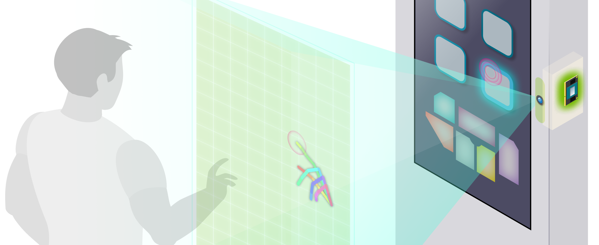
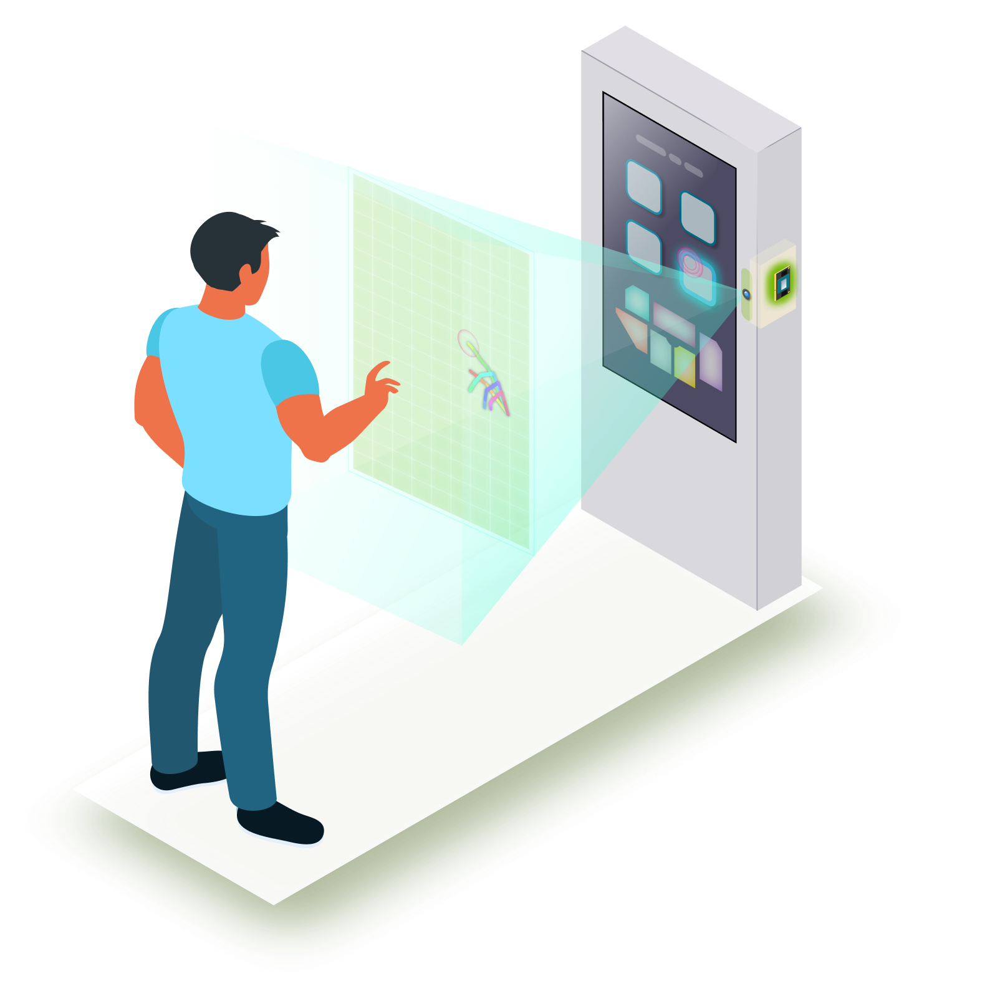

# Jetson Virtual Touchpanel Tool

This tool enables Jetson UI screen to be controlled by hand gesture using an inexpensive RGB camera and AI handpose recognition.



It is primarily desigend for interactive signage systems.<br> 
By utilizing a camera and GPU-accelerated handpose recognition to understand the users hands in real-time, this tool enables users to interact with the UI screen without physically touching the touchpanel or ohter input devices like a mouse.

This tool is based on the following software.
- [`trt_pose`](https://github.com/NVIDIA-AI-IOT/trt_pose) : Underlying work that enables real-time pose estimation on NVIDIA Jetson
- [`trt_pose_hand`](https://github.com/NVIDIA-AI-IOT/trt_pose_hand) : Handpose detection model, gesture classification training and inference logics are derived from this repo.

## Hardware requirement

- Jetson NX Xavier
- USB webcam

## Software setup

### jetson_virtual_touchpanel

If not, clone this repo.<br>
Make sure it's placed in the $HOME directory.

We need following software on Jetson (docker host) to run this tool.

```
sudo apt-get update
sudo apt-get install -y python3-pip
pip3 install pyzmq pynput
```

### Download models

Currently, this tool needs two different models;

- trt_pose model : For handpose detection. Below you can download the TRT optimized model for Jetson Xavier NX.
- SVM model : For understanding the user's gesture

Download the following two files and put them both under `~/jetson_virtual_touchpanel/pub/model`.

| Model | Class | Trained with | Optimized for | Download | original |
|-------|-------|--------------|---------------|----------|----------|
| trt_pose model | `hand` | 2600 images | Jetson Xavier NX |  [handpose_resnet18_att_224x224_nvhand-2k6_trt.pth](https://drive.google.com/file/d/1ALFjVq8gfE0tcvtHuMpu0Qsi_oSRfkWw/view?usp=sharing) | hand_pose_resnet18_baseline_att_224x224_A|
<!-- | trt_pose model | `hand` | 2600 images | Jetson Nano |  [handpose_resnet18_att_224x224_nvhand-2k6_trt.pth](https://drive.google.com/file/d/1rf4WJaFlFFgIfd7vcs-vTnGAnUBJje8g/view?usp=sharing) | [hand_pose_resnet18_baseline_att_224x224_A](https://drive.google.com/file/d/1NCVo0FiooWccDzY7hCc5MAKaoUpts3mo/view?usp=sharing)| -->

| Model | Class | Trained with | Download |
|--------|-----------------|----------------|--------|
| SVM model | `no-hand`, `pan`, `point`, `click`, `(other)` | 200 images | [svmmodel_5class.sav](https://drive.google.com/file/d/1AO-wU5ftYy6SEhoJurCMX5NKDW-0HF2Z/view?usp=sharing) |

> For training your own SVM model for custome gesture classification, check out the [gesture_data_collection_pose.ipynb](https://github.com/NVIDIA-AI-IOT/trt_pose_hand/blob/main/gesture_data_collection_pose.ipynb) and [gesture_data_collection_pose.ipynb](https://github.com/NVIDIA-AI-IOT/trt_pose_hand/blob/main/gesture_training/train_gesture_classification.ipynb) Jupyter notebooks in [`trt_pose_hand`](https://github.com/NVIDIA-AI-IOT/trt_pose_hand) repo.

### Set up jetson-pose-container

```
cd
git clone https://github.com/tokk-nv/jetson-pose-container
cd jetson-pose-container
./scripts/set_nvidia_runtime.sh
```

Also, make `docker` command available without using `sudo`.

```
sudo groupadd docker
sudo usermod -aG docker $USER
```

Reboot, and make sure you can just start the jeston-pose container without using `sudo`.

```
cd
cd jetson-pose-container
./run.sh
```

It should pull the container image from Docker Hub and once that is done it should launch into the terminal within the container.

You can type `exit` to come out.

## How to use

### Physical setup

- Plug a USB webcam to Jetson NX.

> Make sure a device (like `/dev/video0`) is seen on your system. Depending on the device name (number), you need to edit the script (`pub/trtpose_handpose/pub_hand_msg_thread.py:L126`).

- HDMI display

> Connect an HDMI display and make sure the resolution is set to `1920x1080`.

### How to start

On the GUI desktop, open a terminal (`Ctrl` + `Alt` + `t`), then issue the following commands to invoke the indicator script.


```
cd virtual_touchpanel
python3 vtouch_indicator.py
```

You will see a gray-out indicator icon in the desktop top panel bar.<br>
Click on the icon, then select "Start camera-pose service".


This will launch a service (Docker container) that opens the camera and run the trt_pose model to send the recognized handpose data to this tool via ZMQ.<br>
The tool interprets the data and use `pynput` to contol the UI screen simulating mouse input.

> You can still use system's native keyboard and mouse to control the system.

### How to use

- Mouse movement: Hover your hand infront of camera, the tip of your index finger determines the mouse cursor 
- Mouse click: From the state where only your index finger is extended, do the "pinching" motion with your thumb

### How to end

To stop the service, from the Virtual Touchpanel UI menu, select "Stop camera-pose service".<br>
It will take some time (~10sec) to stop the docker container.

To shutdown the tool completely, select "Quit" from the Virtual Touchpanel UI menu.

## Usage scene



- Interactive signage
  - Promotion that lets users to input their info for getting coupons
  - Directory/wayfinding (mall, airport, library, etc.)
- Check-in system for pick-up (user input receipt number)
- Check-in system for health screening

## TODO

- [ ] Support CSI camera (with exposure time control)
- [ ] Optimize ZMQ message handling
- [ ] Support various monitor resolution and 
